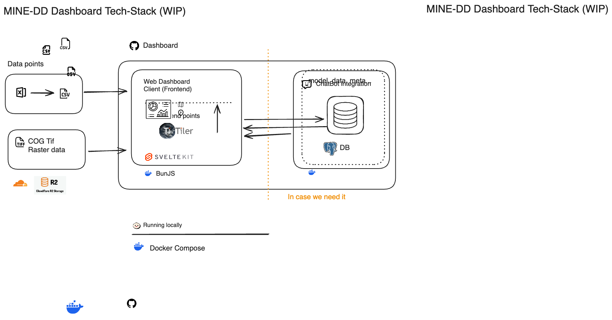

# MINE-DD Dashboard

## Project Overview

This project is the dashboard component for MINE-DD, an initiative by the Netherlands eScience Center. Its primary purpose is to serve and visualize data on an interactive map.

## Problem Solved

The dashboard provides an interactive interface for visualizing geographical data relevant to the MINE-DD project.

## Tech Stack



The application is built using the following technologies:

*   **Frontend:**
    *   SvelteKit (using Svelte 5 runes)
    *   TypeScript
    *   Tailwind CSS
    *   DaisyUI
    *   Maplibre-GL (for the interactive map)
*   **Backend/Runtime:**
    *   Bun.js
*   **Database:**
    *   PostgreSQL
*   **Deployment & Infrastructure:**
    *   Docker & Docker Compose
    *   Vercel (for frontend hosting and cloud functions)
    *   TiTiler (for serving Cloud-Optimized GeoTIFFs)

## Key Features & Functionalities

*   **Interactive Map:** Powered by Maplibre-GL for displaying geographical data.
*   **TiTiler Integration:**
    *   Serves Cloud-Optimized GeoTIFF (COG) raster data efficiently.
    *   Runs as a dedicated Docker service (`docker-compose.yml`).
    *   COG files are expected to be located in the `data/cogs` directory (Note: This directory might need to be created if not present).
    *   Displays COG data using an image-based approach compatible across platforms, including Apple Silicon.
    *   Allows users to toggle the visibility and adjust the opacity of raster layers.
    *   Supports loading remote COG layers directly via URL input in the sidebar (proxied through TiTiler).
    *   Uses nearest-neighbor resampling to maintain sharp edges in raster data during zoom operations.

## Development Setup

Having docker installed is required for the development setup.
```bash
# Clone the repository
git clone https://github.com/escience/mine-dd.git
cd mine-dd/dashboard

# Start the development server
docker compose up -d
```
Visit [http://localhost:5173](http://localhost:5173) to view the application.

## Processing Raster Maps

The repository includes a script for processing raster maps into Cloud Optimized GeoTIFFs (COGs) suitable for web visualization.

### Prerequisites

- GDAL must be installed on your system
  ```bash
  # Install GDAL on macOS using Homebrew
  brew install gdal

  # Install GDAL on Ubuntu/Debian
  sudo apt-get install gdal-bin python3-gdal
  ```

### Using the Script

1. Place your raster files (.tif) in the `data/02_Rasters` directory. You can organize them in subdirectories if desired.

2. Run the conversion script:
   ```bash
   bash process_rasters.sh
   ```

3. The script will:
   - Reproject all rasters to EPSG:4326 (WGS 84) using bilinear resampling
   - Convert them to Cloud Optimized GeoTIFFs with Google Maps Compatible tiling
   - Apply DEFLATE compression to reduce file size
   - Preserve the original directory structure in the output
   - Copy any associated metadata files

4. Processed files will be available in the `data/cogs` directory, maintaining the same subdirectory structure as the input.

### Customization

The script can be modified to adjust:
- Input/output directories by changing the `INPUT_DIR` and `OUTPUT_DIR` variables
- Coordinate reference system by changing the `-t_srs` parameter in the `gdalwarp` command
- Resampling method by changing the `-r` parameter (options include: nearest, bilinear, cubic, cubicspline)
- Compression settings in the `gdal_translate` command

## Next Steps

*(This section will outline planned features and improvements.)*

## Known Issues

*(This section will list any known bugs or limitations.)*
