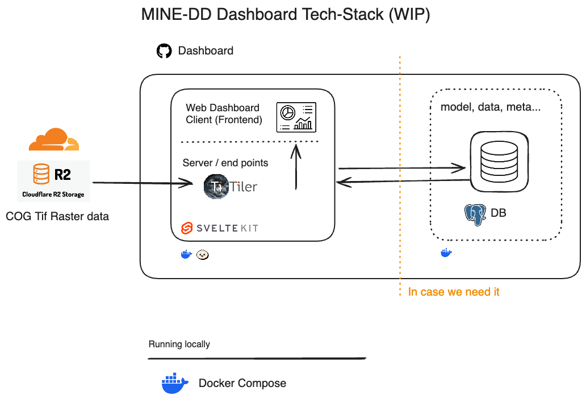

# FAIRmodels-validator Dashboard

FAIRmodels-validator Dashboard is a web application that allows users to validate their FAIRmodels.

Architecture


Database schema


## Quick Start
1. Copy `.env.example` to `.env` and fill in the required variables

## Runnin with Docker
It will run the database, migrations and frontend services.
```bash
docker compose up
```
### Feeding the database for devepment
```bash
# Start everything (including the seed service):
docker compose --profile seed up
# or just run the seed container on demand:
docker compose --profile seed run seed
```

### Docker utils
```bash
docker compose down -v # Remove all volumes, carefull all data will be lost.
docker compose logs -f
```


## Running locally without docker and external database url (or i.e. local postgres running on port 5432)
```bash
bun install
bun dev
```

Visit [http://localhost:5173](http://localhost:5173) to open the application.

## Raster Data Visualization

This dashboard includes a feature for visualizing raster data using Cloud-Optimized GeoTIFFs (COGs).

-   **Technology:** Raster data is served by a [TiTiler](https://developmentseed.org/titiler/) service running within the Docker environment (defined in `docker-compose.yml`).
-   **Usage:**
    -   Navigate to the "Raster Layers" tab in the map sidebar.
    -   Toggle the "Show Example COG" switch to display/hide the raster layer on the map.
    -   Use the slider to adjust the opacity of the raster layer when it's visible.
-   **Data Storage:** Place your COG files in the `data/cogs` directory. The TiTiler service has access to this directory and can serve these files to the application.
-   **Implementation Details:** The application uses an image-based approach to display COG data, which works well on all platforms including Apple Silicon.

### Production Considerations

The application requires HTTPS in production for authentication to work properly.
